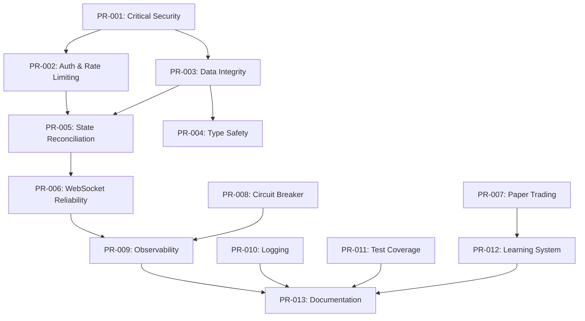

# Small PR Implementation Plan

This document provides a comprehensive breakdown of the Polymarket bot development into small, independently verifiable pull requests. Each PR is designed to be reviewable, testable, and mergeable on its own.

## Overview

This plan builds on the existing foundation already in place (paper trading, WebSocket, risk management) and addresses the remaining production-readiness gaps identified in the security audit and gap analysis reports.

**Current State (Based on v0.1.0):**
- ✅ Paper trading engine with PnL tracking
- ✅ WebSocket market feed with reconnection
- ✅ Order book cache and monitoring
- ✅ Risk manager with kill switch and circuit breakers
- ✅ Basic CLI interface
- ✅ Two-factor live trading gate

**Remaining Work:**
- Address 27 security/reliability findings from audit
- Enhance testing and error handling
- Add observability and monitoring
- Complete documentation and runbook
- Implement advanced features (reconciliation, replay harness, learning system)

---

## PR Sequence

### PR-001: Critical Security Fixes (MUST DO FIRST)
**Priority:** P0 - Blocks live trading  
**Scope:** Fix CRITICAL severity security issues from audit  
**Est. Effort:** 1-2 days

**Changes:**
1. **Secrets Management (A-001)**
   - Add encryption layer for private keys
   - Implement secret manager integration (AWS/Vault/Azure)
   - Add key rotation documentation
   - Add key access audit logging

2. **Kill Switch Persistence (A-002)**
   - Persist kill switch state to disk (JSON file)
   - Check kill switch state on startup
   - Add recovery procedures to runbook
   - Test crash scenarios

3. **CORS Security (A-003)**
   - Replace wildcard CORS with environment-based origins
   - Add `ALLOWED_ORIGINS` environment variable
   - Default to `localhost` only
   - Document production CORS setup

**Acceptance Criteria:**
- [ ] Private keys encrypted at rest or in secure vault
- [ ] Kill switch survives process restart
- [ ] CORS restricted to specific origins
- [ ] All related tests pass
- [ ] Security documentation updated
- [ ] ADR created for secrets management approach

**Files Modified:**
- `apps/backend/src/config/index.ts`
- `apps/backend/src/trading/riskManager.ts`
- `apps/backend/src/server/index.ts`
- `docs/adr/0004-secrets-management.md` (new)
- `docs/runbook.md`
- `.env.example`

**Evidence Required:**
```bash
# Kill switch persistence test
npm run dev &
# Activate kill switch via API
curl -X POST http://localhost:3000/kill-switch
# Kill process
kill $PID
# Restart - should still be killed
npm run dev
# Verify kill switch remains active
```

**Links:**
- [Security Audit - Critical Findings](../REPORTS/AUDIT.md#detailed-findings-by-category)
- [AGENTS.md - Security Requirements](../AGENTS.md#compliance--safety)

---

### PR-002: High Priority Auth & Rate Limiting
**Priority:** P0 - Production requirements  
**Scope:** HIGH severity security issues  
**Est. Effort:** 2-3 days

**Changes:**
1. **Admin Token Required (A-004)**
   - Make `ADMIN_TOKEN` required for server startup
   - Fail fast if missing in production mode
   - Add token validation middleware
   - Document token generation

2. **Rate Limiting (A-008)**
   - Add `express-rate-limit` to all HTTP endpoints
   - Implement per-IP rate limits
   - Add configurable rate limit settings
   - Log rate limit violations

3. **Retry Timeout (A-009)**
   - Add overall timeout cap to retry logic
   - Default: 5 minutes max retry duration
   - Make timeout configurable
   - Add timeout metrics

4. **Balance Fetch Error Handling (A-011)**
   - Throw error on balance fetch failure
   - Implement retry for balance fetches
   - Don't allow trading without balance
   - Add balance staleness check

**Acceptance Criteria:**
- [ ] Server fails to start without `ADMIN_TOKEN` in production
- [ ] All endpoints rate-limited (configurable per-endpoint)
- [ ] Retry logic times out appropriately
- [ ] Balance fetch failures block trading
- [ ] Tests cover all new validation
- [ ] Documentation updated with new env vars

**Files Modified:**
- `apps/backend/src/server/index.ts`
- `apps/backend/src/utils/retry.ts`
- `apps/backend/src/clients/tradingClient.ts`
- `apps/backend/src/config/index.ts`
- `package.json` (add express-rate-limit)
- `.env.example`
- `docs/environment.md`

**Evidence Required:**
```bash
# Test without admin token
ADMIN_TOKEN= npm run dev
# Should fail with clear error

# Test rate limiting
for i in {1..100}; do curl http://localhost:3000/health; done
# Should see 429 responses

# Test retry timeout
# Simulate long-running operation that exceeds timeout
```

**Dependencies:**
- None (can be done immediately)

**Links:**
- [Audit A-004: Auth Bypass](../REPORTS/AUDIT.md#a-004-high---auth-bypass)
- [Audit A-008: No Rate Limiting](../REPORTS/AUDIT.md#a-008-high---no-rate-limiting)

---

### PR-003: Data Integrity & Idempotency
**Priority:** P0 - Prevent duplicate orders  
**Scope:** HIGH severity data consistency issues  
**Est. Effort:** 2-3 days

**Changes:**
1. **Idempotent Client Order IDs (A-006)**
   - Replace timestamp-based IDs with UUID v4
   - Add cryptographic randomness
   - Track submitted orders in memory
   - Prevent duplicate submissions

2. **WebSocket Race Condition (A-007)**
   - Add per-token lock for resync operations
   - Prevent concurrent resync calls
   - Use mutex or semaphore pattern
   - Log lock contention

3. **Message Deduplication (A-010)**
   - Add sequence numbers to WebSocket messages
   - Implement dedup logic on reconnect
   - Track processed message IDs
   - Handle out-of-order messages

**Acceptance Criteria:**
- [ ] Client order IDs are globally unique (UUID v4)
- [ ] No duplicate orders even with retry logic
- [ ] Only one resync per token at a time
- [ ] WebSocket reconnect doesn't duplicate messages
- [ ] Tests verify idempotency
- [ ] Concurrency tests pass

**Files Modified:**
- `apps/backend/src/clients/tradingClient.ts`
- `apps/backend/src/clients/marketFeed.ts`
- `apps/backend/src/clients/websocket.ts`
- `package.json` (add uuid)
- `apps/backend/tests/idempotency.test.ts` (new)

**Evidence Required:**
```typescript
// Test case structure
describe('Idempotency', () => {
  it('does not submit duplicate orders on retry', async () => {
    // Attempt to submit same order twice
    // Verify only one submission to API
  });
  
  it('prevents concurrent resync for same token', async () => {
    // Start two resync operations
    // Verify only one actually runs
  });
});
```

**Links:**
- [Audit A-006: Missing Idempotency](../REPORTS/AUDIT.md#a-006-high---missing-idempotency)
- [Common Pitfalls: Double Order Submission](./ai/common-pitfalls.md#1-double-order-submission)

---

### PR-004: Type Safety & Validation
**Priority:** P1 - Reduce runtime errors  
**Scope:** HIGH severity type safety issues  
**Est. Effort:** 1-2 days

**Changes:**
1. **Unsafe Type Parsing (A-005)**
   - Remove all `@ts-ignore` comments
   - Add Zod schemas for API responses
   - Validate balance fetch response
   - Add type guards

2. **Order ID Validation (A-013)**
   - Require valid orderId for all orders
   - Reject orders without orderId
   - Add validation in order mapping
   - Update TypeScript types

3. **Private Key Validation (A-024)**
   - Add hex string validation for private key
   - Validate key length (64 characters)
   - Fail fast on invalid key format
   - Add validation tests

**Acceptance Criteria:**
- [ ] No `@ts-ignore` comments in production code
- [ ] All API responses validated with Zod
- [ ] Orders require valid orderId
- [ ] Private key format validated on startup
- [ ] Type errors caught at compile time
- [ ] Validation tests comprehensive

**Files Modified:**
- `apps/backend/src/clients/tradingClient.ts`
- `apps/backend/src/config/index.ts`
- `package.json` (add zod)
- `apps/backend/tests/validation.test.ts` (new)

**Evidence Required:**
```bash
# Test invalid private key
PRIVATE_KEY=invalid npm run dev
# Should fail with clear validation error

# Test missing orderId
# Should reject order
```

**Links:**
- [Audit A-005: Unsafe Parsing](../REPORTS/AUDIT.md#a-005-high---unsafe-parsing)
- [TypeScript Strict Mode](../tsconfig.base.json)

---

### PR-005: State Reconciliation & Position Tracking
**Priority:** P1 - Production reliability  
**Scope:** MEDIUM severity state management issues  
**Est. Effort:** 2-3 days

**Changes:**
1. **Startup Reconciliation**
   - Fetch all open orders on startup
   - Fetch current positions from API
   - Reconcile in-memory state
   - Handle orphaned orders
   - Log reconciliation results

2. **Position Calculation Fix (A-014)**
   - Include partially filled orders in position calc
   - Use `filledSize` for OPEN orders
   - Update position tracking logic
   - Add position reconciliation tests

3. **Order Lifecycle Tracking**
   - Track order state transitions
   - Log all state changes
   - Validate state machine transitions
   - Add metrics for order states

**Acceptance Criteria:**
- [ ] Bot reconciles state on every startup
- [ ] Position calculation includes partial fills
- [ ] Orphaned orders handled gracefully
- [ ] State transitions logged completely
- [ ] Reconciliation tests comprehensive
- [ ] Recovery procedures documented

**Files Modified:**
- `apps/backend/src/clients/tradingClient.ts`
- `apps/backend/src/index.ts`
- `apps/backend/tests/reconciliation.test.ts` (new)
- `docs/runbook.md`

**Evidence Required:**
```bash
# Place orders, kill bot, restart
# Verify orders are discovered and tracked
# Check logs for reconciliation output
```

**Links:**
- [Audit A-014: Position Calculation](../REPORTS/AUDIT.md#a-014-medium---position-calculation)
- [Common Pitfalls: State Reconciliation](./ai/common-pitfalls.md#5-no-state-reconciliation-on-startup)

---

### PR-006: WebSocket Reliability Improvements
**Priority:** P1 - Connection stability  
**Scope:** MEDIUM severity WebSocket issues  
**Est. Effort:** 2 days

**Changes:**
1. **Cache Staleness (A-015)**
   - Add TTL (time-to-live) to cached orderbooks
   - Default: 30 seconds
   - Auto-refresh stale data
   - Add cache hit/miss metrics

2. **Reconnect Timer Cleanup (A-016)**
   - Clear reconnect timer in all close paths
   - Fix memory leak on multiple reconnects
   - Add cleanup tests
   - Monitor for timer leaks

3. **Graceful Shutdown (A-017)**
   - Await market feed stop() on shutdown
   - Close WebSocket connections gracefully
   - Wait for pending operations
   - Add shutdown timeout

**Acceptance Criteria:**
- [ ] Cached data expires after TTL
- [ ] Reconnect timers cleaned up properly
- [ ] Graceful shutdown completes within timeout
- [ ] No memory leaks on reconnect
- [ ] WebSocket connection tests comprehensive
- [ ] Shutdown procedures documented

**Files Modified:**
- `apps/backend/src/clients/orderbookCache.ts`
- `apps/backend/src/clients/websocket.ts`
- `apps/backend/src/server/index.ts`
- `apps/backend/tests/websocket-reliability.test.ts` (new)

**Evidence Required:**
```bash
# Test reconnect cycles
# Monitor memory usage
# Verify timers cleared

# Test graceful shutdown
npm run dev &
# Send SIGTERM
# Verify clean shutdown
```

**Links:**
- [Audit A-015, A-016, A-017](../REPORTS/AUDIT.md)
- [Common Pitfalls: WebSocket Disconnects](./ai/common-pitfalls.md#4-not-handling-websocket-disconnects)

---

### PR-007: Paper Trading Improvements
**Priority:** P1 - Testing accuracy  
**Scope:** MEDIUM severity paper trading realism  
**Est. Effort:** 2 days

**Changes:**
1. **Partial Fill Simulation (A-019)**
   - Support configurable partial fill amounts
   - Simulate realistic fill rates
   - Add fill probability based on liquidity
   - Time-based partial fills

2. **Slippage Calculation (A-020)**
   - Scale slippage with order size
   - Use available liquidity from orderbook
   - Add market impact model
   - Configurable slippage settings

3. **Paper Trading Replay Harness**
   - Record live market data
   - Replay historical data
   - Validate strategy performance
   - Add replay CLI command

**Acceptance Criteria:**
- [ ] Partial fills configurable and realistic
- [ ] Slippage scales with order size
- [ ] Paper trading matches live behavior
- [ ] Replay harness functional
- [ ] Paper trading tests comprehensive
- [ ] Documentation for paper trading setup

**Files Modified:**
- `apps/backend/src/trading/paperTradingEngine.ts`
- `apps/backend/src/cli/index.ts`
- `apps/backend/tests/paperTrading.test.ts` (enhanced)
- `docs/paper-trading.md`

**Evidence Required:**
```bash
# Run paper trading with various order sizes
# Verify realistic slippage
# Compare with live market behavior

# Test replay harness
npm run replay -- --date 2024-01-01 --market <id>
```

**Links:**
- [Audit A-019, A-020](../REPORTS/AUDIT.md)
- [Paper Trading Guide](./paper-trading.md)

---

### PR-008: Circuit Breaker & Error Handling Improvements
**Priority:** P1 - Reliability  
**Scope:** MEDIUM severity error handling  
**Est. Effort:** 2 days

**Changes:**
1. **Circuit Breaker Auto-Reset (A-018)**
   - Add time-based circuit breaker reset
   - Half-open state to test recovery
   - Configurable recovery timeout
   - Log circuit breaker state transitions

2. **Error Boundary Improvements (A-012)**
   - Add error boundaries to all critical paths
   - Fail startup on trading client init failure
   - Add degraded mode support
   - Clear status indicators

3. **Retry Backoff Jitter (A-023)**
   - Add random jitter to retry delays
   - Prevent thundering herd
   - Configurable jitter percentage
   - Log retry attempts with jitter

**Acceptance Criteria:**
- [ ] Circuit breaker resets after recovery period
- [ ] Critical failures stop startup
- [ ] Retry jitter prevents synchronized retries
- [ ] Error boundaries catch all exceptions
- [ ] Circuit breaker tests comprehensive
- [ ] Error handling documented

**Files Modified:**
- `apps/backend/src/trading/riskManager.ts`
- `apps/backend/src/server/index.ts`
- `apps/backend/src/utils/retry.ts`
- `apps/backend/tests/circuitBreaker.test.ts` (enhanced)

**Evidence Required:**
```bash
# Simulate service failures
# Verify circuit breaker opens and auto-resets
# Check retry jitter timing
```

**Links:**
- [Audit A-018: Circuit Breaker](../REPORTS/AUDIT.md#a-018-medium---no-circuit-breaker-reset)
- [Common Pitfalls: Circuit Breakers](./ai/common-pitfalls.md#8-no-circuit-breakers)

---

### PR-009: Observability & Metrics
**Priority:** P1 - Monitoring  
**Scope:** LOW severity (missing feature)  
**Est. Effort:** 3-4 days

**Changes:**
1. **Metrics Infrastructure (A-027)**
   - Add Prometheus client library
   - Implement metrics collection
   - Create metrics registry
   - Add metrics endpoint

2. **Core Metrics**
   - Order success/failure rate
   - WebSocket connection health
   - API request latency
   - Circuit breaker state
   - Kill switch activations
   - Position value and PnL
   - Cache hit/miss rate

3. **Dashboard**
   - Create Grafana dashboard JSON
   - Add dashboard screenshots to docs
   - Document metrics meanings
   - Add alerting rules

**Acceptance Criteria:**
- [ ] Prometheus metrics endpoint (`/metrics`)
- [ ] All critical operations instrumented
- [ ] Grafana dashboard configured
- [ ] Metrics documentation complete
- [ ] Sample alerts defined
- [ ] Dashboard screenshots in docs

**Files Modified:**
- `apps/backend/src/utils/metrics.ts` (new)
- `apps/backend/src/server/index.ts`
- `apps/backend/src/clients/tradingClient.ts`
- `apps/backend/src/clients/websocket.ts`
- `apps/backend/src/trading/riskManager.ts`
- `package.json` (add prom-client)
- `docs/observability.md` (new)
- `dashboards/grafana.json` (new)

**Evidence Required:**
```bash
# Start bot and visit metrics endpoint
curl http://localhost:3000/metrics

# Verify metrics exported
# Import Grafana dashboard
# Take screenshots
```

**Links:**
- [Audit A-027: Missing Metrics](../REPORTS/AUDIT.md#a-027-low---missing-metrics)
- [Runbook: Monitoring](./runbook.md)

---

### PR-010: Logging & Privacy Improvements
**Priority:** P2 - Nice to have  
**Scope:** LOW severity logging issues  
**Est. Effort:** 1 day

**Changes:**
1. **Wallet Address Masking (A-022)**
   - Mask wallet addresses in logs
   - Show only first 6 and last 4 chars
   - Add privacy-safe logging utilities
   - Audit logs for sensitive data

2. **Structured Logging Enhancements**
   - Add request IDs to all logs
   - Include correlation IDs
   - Add log sampling for high-volume events
   - Improve log searchability

3. **Log Levels & Configuration**
   - Make log level configurable
   - Add debug mode
   - Document log output format
   - Add log rotation

**Acceptance Criteria:**
- [ ] Wallet addresses masked in all logs
- [ ] No sensitive data in logs
- [ ] Request IDs in all logs
- [ ] Log level configurable
- [ ] Logging documentation complete
- [ ] Log audit passed

**Files Modified:**
- `apps/backend/src/utils/logger.ts`
- `apps/backend/src/clients/tradingClient.ts`
- `apps/backend/src/config/index.ts`
- `.env.example`
- `docs/runbook.md`

**Evidence Required:**
```bash
# Review logs for sensitive data
grep -r "0x[a-fA-F0-9]\{40\}" logs/
# Should show masked addresses only

# Test different log levels
LOG_LEVEL=debug npm run dev
```

**Links:**
- [Audit A-022: Logging Exposure](../REPORTS/AUDIT.md#a-022-low---logging-exposure)

---

### PR-011: Test Coverage Expansion
**Priority:** P1 - Quality assurance  
**Scope:** LOW severity (missing tests)  
**Est. Effort:** 3-4 days

**Changes:**
1. **Critical Path Tests (A-025)**
   - Kill switch persistence tests
   - Reconciliation tests
   - WebSocket reconnect tests
   - Circuit breaker tests
   - Idempotency tests

2. **Integration Tests**
   - End-to-end order flow
   - Paper trading scenarios
   - Error recovery tests
   - Replay harness tests

3. **Chaos Tests**
   - Network disconnect simulation
   - API failure simulation
   - Concurrent operation tests
   - Race condition tests

**Acceptance Criteria:**
- [ ] >80% code coverage
- [ ] All critical paths tested
- [ ] Integration tests comprehensive
- [ ] Chaos tests validate reliability
- [ ] CI/CD runs all tests
- [ ] Test documentation complete

**Files Modified:**
- `apps/backend/tests/*.test.ts` (many new tests)
- `.github/workflows/test.yml` (new)
- `docs/testing.md` (new)

**Evidence Required:**
```bash
# Run tests with coverage
npm test -- --coverage

# Coverage report should show >80%
# All critical paths covered
```

**Links:**
- [Audit A-025: Test Coverage](../REPORTS/AUDIT.md#a-025-low---test-coverage)
- [Implementation Checklist: Testing](./implementation-checklist.md#hardening--verification)

---

### PR-012: Learning System Foundation
**Priority:** P2 - Future feature  
**Scope:** Scaffold for learning/ML integration  
**Est. Effort:** 2-3 days

**Changes:**
1. **Data Collection**
   - Log all trading decisions
   - Record outcomes (PnL)
   - Store market conditions
   - Export to training format

2. **Hook Points**
   - Strategy selection hook
   - Parameter optimization hook
   - Signal generation hook
   - Feature extraction

3. **Analysis Pipeline**
   - Historical analysis CLI
   - Performance metrics
   - Strategy comparison
   - Backtesting framework

**Acceptance Criteria:**
- [ ] Trading decisions logged with outcomes
- [ ] Data export functionality
- [ ] Hook points documented
- [ ] Basic backtesting works
- [ ] Learning system design doc
- [ ] Future roadmap defined

**Files Modified:**
- `apps/backend/src/learning/collector.ts` (new)
- `apps/backend/src/learning/hooks.ts` (new)
- `apps/backend/src/cli/index.ts`
- `docs/learning-system.md` (new)

**Evidence Required:**
```bash
# Collect trading data
npm run collect-data -- --days 7

# Export for analysis
npm run export-data -- --format csv

# Run backtest
npm run backtest -- --strategy market-making --date 2024-01-01
```

**Links:**
- [Issue #29: Learning System Design](https://github.com/sedarged/polymarket-bot/issues/29)
- [Gap Analysis: ML Integration](../REPORTS/GAP_ANALYSIS.md)

---

### PR-013: Documentation Completion
**Priority:** P1 - Production readiness  
**Scope:** Final documentation pass  
**Est. Effort:** 2 days

**Changes:**
1. **Runbook Completion**
   - Startup procedures
   - Shutdown procedures
   - Incident response
   - Troubleshooting guide
   - Escalation paths

2. **Architecture Decision Records**
   - ADR-0004: Secrets Management
   - ADR-0005: Circuit Breaker Strategy
   - ADR-0006: Observability Approach
   - ADR-0007: Learning System Design

3. **Cross-linking**
   - Link all docs to STATUS.md
   - Update all references
   - Fix broken links
   - Add navigation

4. **Compliance Documentation**
   - Terms of Service compliance
   - Geoblocking documentation
   - Risk disclosures
   - Liability disclaimers

**Acceptance Criteria:**
- [ ] Runbook 100% complete
- [ ] All ADRs written
- [ ] No broken links
- [ ] All docs cross-referenced
- [ ] Compliance docs complete
- [ ] Link checker passes

**Files Modified:**
- `docs/runbook.md`
- `docs/adr/*.md` (new ADRs)
- `docs/README.md`
- `docs/compliance.md` (new)
- All documentation files (links)

**Evidence Required:**
```bash
# Run link checker
npm run check-links

# Verify all procedures documented
# Review with compliance checklist
```

**Links:**
- [Documentation Index](./README.md)
- [AGENTS.md: Documentation Standards](../AGENTS.md#documentation)

---

## Completion Checklist

### Pre-Merge Requirements (All PRs)
Each PR must meet these criteria before merge:

- [ ] All tests pass (`npm test`)
- [ ] Linter passes (`npm run lint`)
- [ ] TypeScript compiles (`npm run build`)
- [ ] No new security vulnerabilities
- [ ] Documentation updated
- [ ] CHANGELOG.md updated
- [ ] Acceptance criteria met
- [ ] Evidence provided in PR description
- [ ] Reviewed by at least one maintainer
- [ ] ADR created if architectural change

### Production Readiness Checklist
After all PRs merged:

- [ ] All CRITICAL audit findings resolved
- [ ] All HIGH audit findings resolved
- [ ] Test coverage >80%
- [ ] Runbook complete
- [ ] Monitoring/alerting configured
- [ ] Secrets properly managed
- [ ] Compliance documentation complete
- [ ] Performance tested
- [ ] Chaos testing passed
- [ ] Security review completed

---

## PR Dependencies



**Critical Path:** PR-001 → PR-002 → PR-003 → PR-005 → PR-006 → PR-009 → PR-013

**Parallel Tracks:**
- Security: PR-001 → PR-002 → PR-003 → PR-004
- Reliability: PR-005 → PR-006 → PR-008 → PR-009
- Quality: PR-007 → PR-010 → PR-011 → PR-013
- Features: PR-012 → PR-013

---

## Timeline Estimate

**Aggressive (Full-Time):** 3-4 weeks
- Week 1: PR-001, PR-002, PR-003, PR-004
- Week 2: PR-005, PR-006, PR-007, PR-008
- Week 3: PR-009, PR-010, PR-011
- Week 4: PR-012, PR-013

**Conservative (Part-Time):** 6-8 weeks
- Weeks 1-2: Critical security (PR-001, PR-002)
- Weeks 3-4: Data integrity & reliability (PR-003, PR-004, PR-005, PR-006)
- Weeks 5-6: Improvements & observability (PR-007, PR-008, PR-009)
- Weeks 7-8: Testing & documentation (PR-010, PR-011, PR-012, PR-013)

---

## Evidence Collection Template

For each PR, include this evidence in the PR description:

```markdown
## Evidence of Completion

### Tests
\`\`\`bash
npm test
# [paste output showing all tests passing]
\`\`\`

### Build
\`\`\`bash
npm run build
# [paste output showing successful build]
\`\`\`

### Lint
\`\`\`bash
npm run lint
# [paste output showing no issues]
\`\`\`

### Functional Validation
\`\`\`bash
# [paste commands run to validate feature]
# [paste output showing expected behavior]
\`\`\`

### Screenshots (if UI changes)
[Attach screenshots]

### Performance Metrics (if applicable)
[Include before/after metrics]

### Security Check
- [ ] No secrets committed
- [ ] No new vulnerabilities introduced
- [ ] Audit findings addressed

### Documentation
- [ ] Code comments added
- [ ] API documentation updated
- [ ] Runbook updated
- [ ] CHANGELOG updated
- [ ] ADR created (if architectural)

### Acceptance Criteria
- [ ] [List each criterion from PR plan]
- [ ] [Check off when met]
```

---

## Related Documentation

- [AGENTS.md](../AGENTS.md) - AI agent guidelines
- [STATUS.md](../STATUS.md) - Current work status
- [Implementation Checklist](./implementation-checklist.md) - Detailed task list
- [Master Plan](./master-plan.md) - Comprehensive roadmap
- [Security Audit](../REPORTS/AUDIT.md) - 27 findings to address
- [Gap Analysis](../REPORTS/GAP_ANALYSIS.md) - Production readiness gaps
- [Architecture](./architecture.md) - System design
- [Runbook](./runbook.md) - Operations manual

---

## Success Metrics

### Code Quality
- Test coverage >80%
- Zero CRITICAL vulnerabilities
- Zero HIGH vulnerabilities
- TypeScript strict mode enabled
- Lint warnings = 0

### Operational Excellence
- Mean time to recovery <5 minutes
- Uptime >99.9%
- Order success rate >99%
- API error rate <0.1%
- WebSocket connection uptime >99.9%

### Compliance & Safety
- Two-factor live trading gate enforced
- Kill switch functional and persistent
- Rate limiting prevents abuse
- Secrets properly managed
- Geoblocking respected

---

## Notes

- This plan assumes current v0.1.0 baseline
- Each PR should take 1-4 days
- PRs can be parallelized where dependencies allow
- Security PRs (001-004) must complete before live trading
- Documentation PRs (010, 013) can run in parallel
- Learning system (012) is lower priority, can be deferred

---

**Last Updated:** 2026-02-01  
**Status:** Draft - Ready for Review  
**Owner:** Development Team  
**Reviewers:** Security Team, Operations Team
